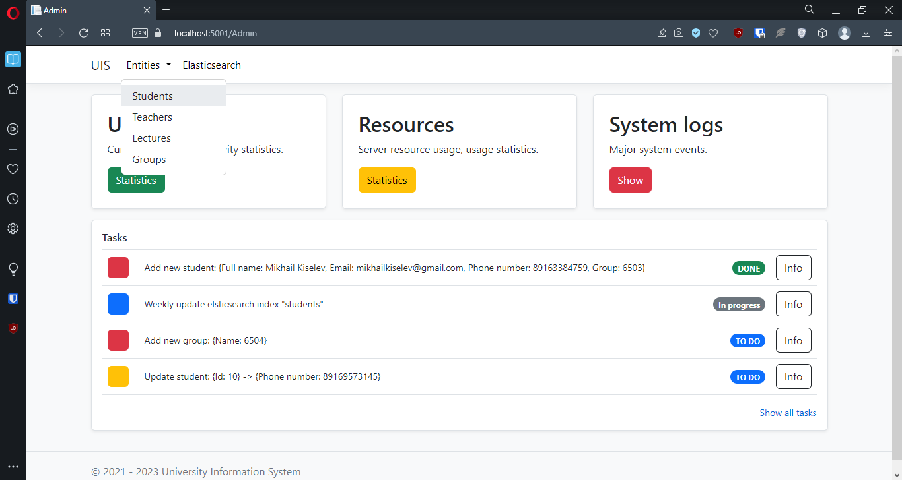

## **University Information System**
### It is an information system designed for the internal purposes of universities (currently under development).

## Available functionality:
### 1. Admin zone
- ### Student entity management (CRUD);
- ### "students" index management in elasticsearch (create + save many, delete).
### 2. Shared access area
- ### Search for students registered in the system by various parameters (name, group, etc.);
- ### Search by student attendance filters.

## Screenshots:
### 1. 
### 2. 
### 3. 
### 4. 
### 5. 
### 6. 
### 7. 
